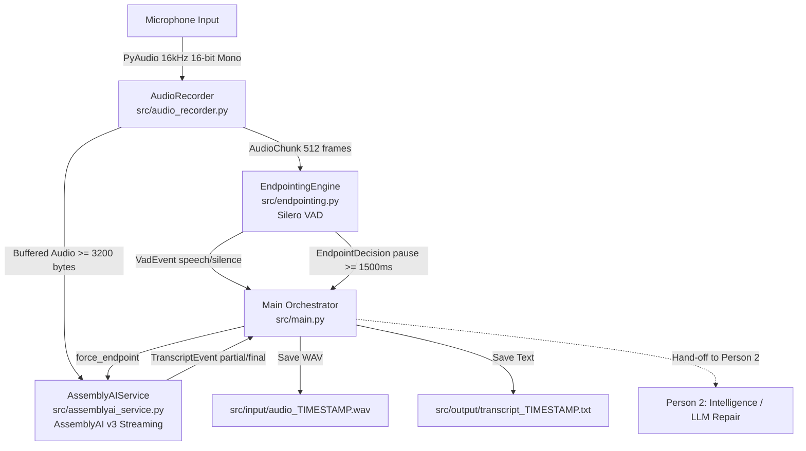

# ClearVoice 2.0 — Speech Input & Real-Time STT Pipeline (Person 1)

This module implements the **Person 1 — Speech Input & STT** workstream for **ClearVoice 2.0**, as defined in the project architecture. It handles microphone audio capture, Voice Activity Detection (VAD), custom stutter/pause endpointing, and streaming transcription using the **AssemblyAI Real-Time v3 SDK**.

---

## 1. Architecture & Workflow



### End-to-End Flow:
1. **Audio Ingestion (`audio_recorder.py`)**:
   - Captures microphone input at `16,000 Hz`, single channel (mono), 16-bit signed integer PCM (`pyaudio.paInt16`).
   - Emits structured `AudioChunk` objects (512 samples / 1024 bytes per chunk) in non-blocking cbreak terminal mode toggled with the `'M'` key.
2. **VAD & Custom Endpointing (`endpointing.py`)**:
   - Processes each 512-sample chunk through a pre-trained **Silero VAD** model.
   - Accurately detects `speech` vs `silence`.
   - Implements **ClearVoice Custom Endpointing (CP-3)**: Ignores short pauses and stutters (< 1500 ms) so the speaker is not prematurely cut off. Only when silence duration exceeds `1500 ms` does it finalize the utterance.
3. **Real-Time STT (`assemblyai_service.py`)**:
   - Streams audio chunks (buffered to >= 3200 bytes / 100 ms to satisfy AssemblyAI's 50–1000 ms chunk requirement).
   - Uses AssemblyAI v3 SDK (`RealTimeTranscriber`) configured with `language_codes=["en"]`.
   - Tracks turn lifecycle and converts streaming `TurnEvent` messages into standard `TranscriptEvent` contracts.
   - When custom endpointing triggers, calls `force_endpoint()` to finalize turns immediately.
4. **Output Persistence (`main.py`)**:
   - Saves raw audio to `src/input/audio_<timestamp>.wav`.
   - Saves both the **Partial** (interim hypothesis) and **Clean** (finalized STT text) to `src/output/transcript_<timestamp>.txt`.

---

## 2. Shared Data Contracts (`src/contracts.py`)

All modules adhere to the contracts defined on Day 1 of the ClearVoice 2.0 Task Board:

### `AudioChunk` (Audio Ingestion Output)
```python
class AudioChunk(TypedDict):
    session_id: str       # Unique UUID for the recording session
    sequence: int         # Incrementing chunk counter (0, 1, 2...)
    timestamp_ms: int     # Milliseconds elapsed since recording started
    payload: bytes        # Raw PCM 16-bit mono audio bytes (512 samples = 1024 bytes)
    sample_rate: int      # 16000
    channels: int         # 1
```

### `VadEvent` (VAD Output)
```python
class VadEvent(TypedDict):
    session_id: str
    state: str                 # "speech" | "silence"
    timestamp_ms: int          # Timestamp of event
    silence_duration_ms: Optional[int] # Accumulated silence duration (ms)
```

### `EndpointDecision` (Endpointing Output)
```python
class EndpointDecision(TypedDict):
    session_id: str
    utterance_id: str          # e.g., "{session_id}_{timestamp_ms}"
    finalized: bool            # True when silence threshold (1500ms) is reached
    reason: str                # "pause" | "transcript_final" | "manual" | "timeout"
    timestamp_ms: int
```

### `TranscriptEvent` (STT Output — Consumed by Person 2)
```python
class TranscriptEvent(TypedDict):
    type: str                  # "transcript.partial" | "transcript.final"
    version: int               # 1
    session_id: str
    utterance_id: str          # AssemblyAI turn order or flushed ID
    text: str                  # Transcribed text
    is_final: bool             # False for in-progress partials, True for finalized turn
    confidence: Optional[float]# Confidence score (0.0 - 1.0)
    start_ms: int              # Audio start offset in milliseconds
    end_ms: int                # Audio end offset in milliseconds
```

---

## 3. Inputs & Outputs

### Input
* **Microphone**: Live microphone stream captured via PyAudio.
* **Format**: 16 kHz sample rate, 16-bit linear PCM, mono.
* **File Input Archive**: Every recording session saves the full uncompressed audio to:
  ```
  src/input/audio_YYYYMMDD_HHMMSS.wav
  ```

### Output
The transcription results are written in real-time to:
```
src/output/transcript_YYYYMMDD_HHMMSS.txt
```

Each completed utterance is logged with both its raw interim streaming state and the finalized STT result:

```text
Partial:
My, my, my name is Rohan.s, is, ise.

Clean:
My, my, my name is Rohan.

----------------------------------------
```

* **`Partial`**: The raw interim speech hypothesis as captured while the speaker was in the middle of talking (reflects verbatim repetitions and acoustic hesitations).
* **`Clean`**: The finalized turn emitted by AssemblyAI once silence or custom endpointing triggered.

---

## 4. Integration Guide for Person 2 (Intelligence / LLM Repair)

Person 2 builds: `TranscriptEvent` → **Dysfluency Analysis / LLM Repair** → `RepairResult`.

### How to consume live `TranscriptEvent`s:
In your orchestrator or intelligence service, register a callback with `AssemblyAIService`:

```python
from assemblyai_service import AssemblyAIService
from contracts import TranscriptEvent

def on_transcript(event: TranscriptEvent):
    if event["is_final"]:
        print(f"Received raw final STT: {event['text']}")
        # Person 2 processes this through LLM repair:
        # repair_result = llm_repair_engine.repair(event['text'])
    else:
        # Optional: update UI with partial preview
        pass

aai_service = AssemblyAIService(api_key=os.environ["ASSEMBLYAI_API_KEY"])
aai_service.on_transcript_event = on_transcript
```

### Mocking Person 1 for Testing (Unblocked by Design):
Person 2 does not need a working microphone to test LLM repair. You can create mock `TranscriptEvent` objects:

```python
mock_event: TranscriptEvent = {
    "type": "transcript.final",
    "version": 1,
    "session_id": "test-session-001",
    "utterance_id": "turn-1",
    "text": "I I I wanted to book an appointment for Friday... no Wednesday.",
    "is_final": True,
    "confidence": 0.95,
    "start_ms": 1000,
    "end_ms": 5500
}
```

---

## 5. File Structure

```text
src/
├── contracts.py           # Shared TypedDict definitions (Data Contracts)
├── audio_recorder.py      # PyAudio-based interactive mic recorder
├── endpointing.py         # Silero VAD + 1500ms pause endpointing logic
├── assemblyai_service.py  # AssemblyAI v3 Real-Time Transcriber wrapper
├── main.py                # Pipeline orchestrator
├── input/                 # Saved session WAV recordings (gitignored)
├── output/                # Saved transcript text files (gitignored)
└── readmestt.md           # This architecture & workflow guide
```

---

## 6. How to Run

### Prerequisites
1. Ensure the Python environment has the required dependencies:
   ```bash
   pip install pyaudio assemblyai torch numpy python-dotenv
   ```
2. Set your AssemblyAI API key in `.env`:
   ```bash
   ASSEMBLYAI_API_KEY=your_assemblyai_api_key_here
   ```

### Execution
Run `main.py` using your environment:
```bash
python src/main.py
```

### Usage Controls
* Press **`M`** once to begin recording. Speak into the microphone.
* Stutters and pauses `< 1.5s` will keep the utterance active.
* Pauses `> 1.5s` trigger `[ENDPOINT]` and finalize the utterance.
* Press **`M`** again to stop the session and flush any remaining audio.
* Transcripts are printed live and saved in `src/output/`.
